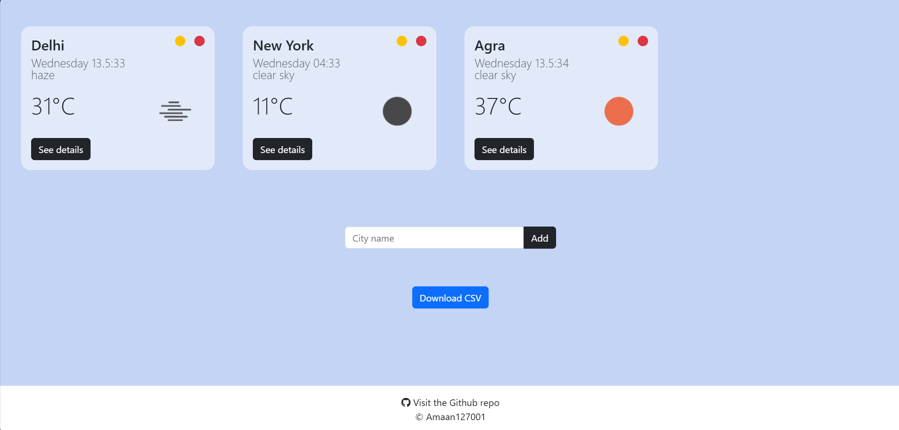

# Weather-App

A sleek and responsive React application that lets you view current weather data and a 5-day forecast for cities or postal codes of your choice. This project showcases frontend skills, API integration, and CRUD operations with local storage. It also includes a feature to download current weather data as a CSV file!

## Table of Contents

- [Features](#features)
- [Demo](#demo)
- [Installation](#installation)
- [Configuration](#configuration)
- [Usage](#usage)
- [Technologies](#technologies)
- [Project Structure](#project-structure)

## Features

- **CRUD Operations:**  
  Add, update, or remove weather widgets.
  
- **Real-Time Weather:**  
  Fetches current weather data using the [OpenWeather API](https://openweathermap.org/api).

- **5-Day Forecast:**  
  View a detailed 5-day forecast when clicking "See details" on a widget.

- **Postal Code & City Support:**  
  Enter either a city name or postal code (automatically detects the country based on postal code length).

- **Local Storage:**  
  All widgets are stored locally, so your data persists across browser sessions.

- **CSV Download:**  
  Download current weather data from all widgets in CSV format with a single click.

## Demo




## Installation

1. **Clone the repository:**

   ```bash
   git clone https://github.com/Amaan127001/AI_Internship.git
   cd AI_Internship

2. **Install dependencies:**

   ```bash
   npm install

## Configuration

1. **Obtain an API Key:**
   * Sign up at OpenWeatherMap to get your free API key.

2. **Set up Environment Variables:**
   * Create a .env file in the root of your project and add your API key:
   ```bash
   REACT_APP_API_KEY=your_openweathermap_api_key_here

## Usage

1. **Run the Application:**
   * Start the React development server:
   ```bash
   npm start

2. **Using the App:**
   * Add a City/Postal Code
   * View Weather Data
   * Update or Remove Widgets
   * Download CSV


## Technologies

* React: Frontend library for building user interfaces.
* Axios: For API calls.
* React Toastify: For elegant notifications.
* OpenWeatherMap API: Provides current weather and 5-day forecast data.
* Local Storage: To persist widget data across sessions.
* Bootstrap (Optional): For responsive layout and collapse functionality in widgets.

## Project Structure

```bash
Weather-App/
├── public/
│   └── style.css           # Global styling
├── src/
│   ├── api/
│   │   └── index.js        # API integration for fetching weather and forecast data
│   ├── components/
│   │   ├── Form.js         # Form for entering city or postal code
│   │   ├── Heading.js      # Application header
│   │   └── widget/
│   │       ├── Widget.js   # Individual weather widget card (includes details toggle)
│   │       └── Widgets.js  # Container for all widgets
│   │   └── DownloadCSV.js  # Component to download current data as CSV
│   ├── App.js              # Main application component
│   └── index.js            # Entry point for React
├── .env                    # Environment variables file (not committed)
├── package.json            # Project dependencies and scripts
└── README.md               # This file!
